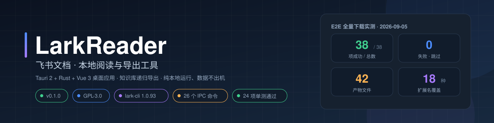
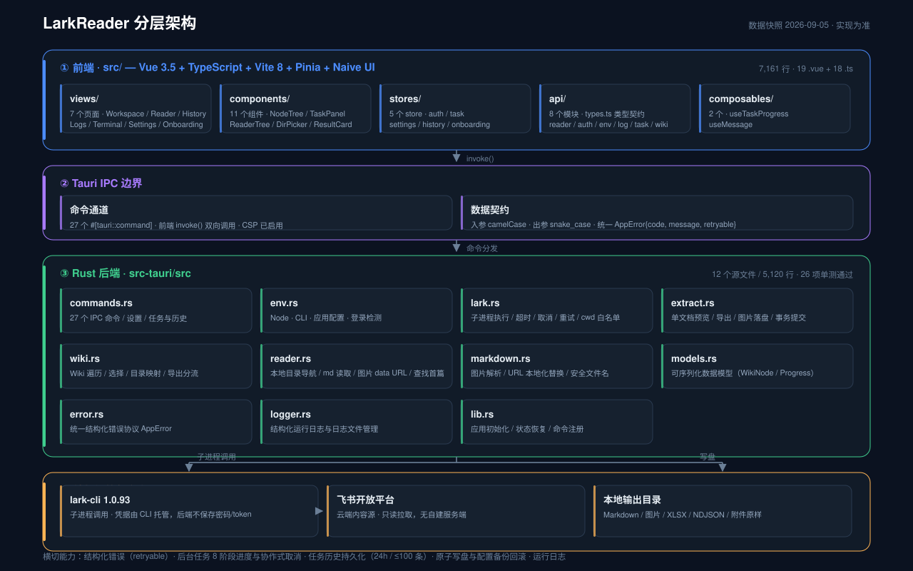
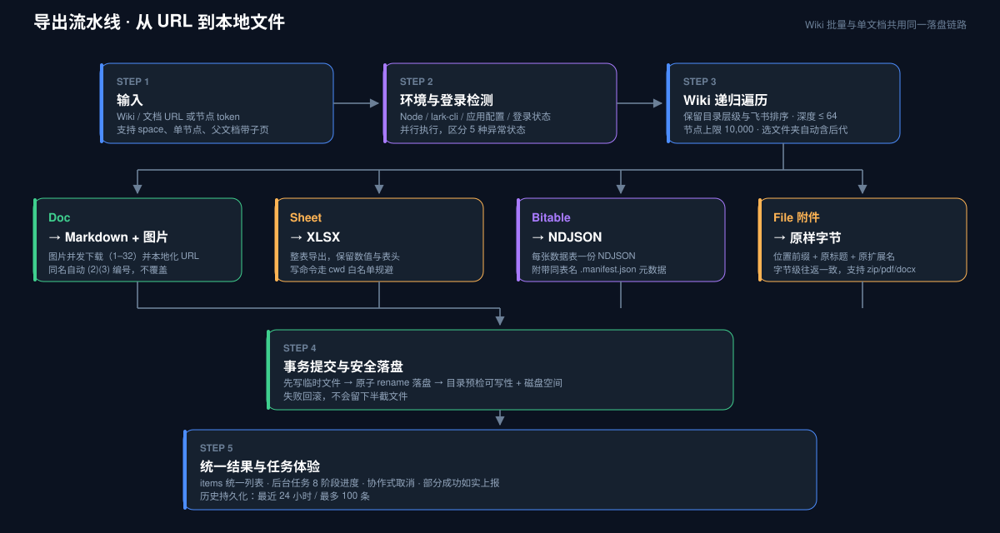
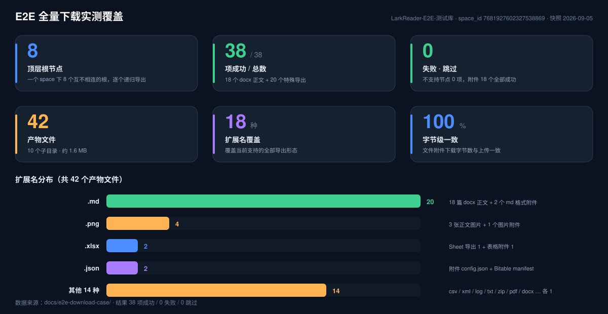

<div align="center">



<br>

[](./docs/BACKEND.md)
[](./LICENSE)
[](https://tauri.app)
[](https://www.rust-lang.org)
[](https://vuejs.org)
[](#-验证与实测)
[](./docs/BACKEND.md)

**飞书文档 · 本地阅读与导出工具**

基于 Tauri 2 + Rust + Vue 3 的桌面应用。知识库递归导出，纯本地运行、数据不出机。

[核心功能](#-核心功能) · [架构](#-架构) · [快速开始](#-快速开始) · [验证与实测](#-验证与实测) · [FAQ](#-faq) · [🌐 产品主页](https://lpk3215.github.io/LarkReader/)

</div>

---

## 📖 简介

LarkReader 解决一个具体问题：**把飞书知识库变成你硬盘上可直接阅读、离线可用的文件**。

- **导出**：递归遍历知识库，Doc → Markdown（图片本地化）、Sheet → XLSX、Bitable → NDJSON、file 附件 → 原样字节，整棵目录树按飞书层级与排序落盘；
- **阅读**：内置「本地阅读」页，直接浏览已导出的 Markdown 与图片，不依赖网络和飞书登录；
- **边界**：纯本地工具，无自建服务端、无遥测。凭据由官方 `lark-cli` 在本机托管，LarkReader 不保存飞书密码或 token。

> 完整的功能、接口、架构、验证状态和后续边界统一记录在 [后端功能与维护手册](docs/BACKEND.md)（唯一主文档，代码实现始终是最终依据）。

## 🎯 使用场景

当知识库内容多、目录深、要在网络不稳定的环境下翻阅已读资料时，LarkReader 可以帮你把内容备份到本地、用更顺手的方式阅读。详细示例与典型场景图见 [docs/使用场景.md](docs/使用场景.md)。

已用一个真实的飞书知识库做过端到端验证：[docs/e2e-download-case/](docs/e2e-download-case/) 是那次导出的完整产物，8 个顶层节点、38 项成功 / 0 失败 / 0 跳过，覆盖 docx 正文、Sheet、Bitable、文件附件四类节点，目录层级与飞书一致。

## ✨ 核心功能

| 能力 | 说明 |
|---|---|
| 🔐 环境与认证 | 自动检测 Node.js / lark-cli / 应用配置 / 登录状态（并行检测，区分 5 种异常）；固定安装 `@larksuite/cli@1.0.93`；设备码登录，配置向导自动弹浏览器 |
| 📄 单文档导出 | 接受 Wiki URL 或节点 token；Markdown 正文 + 图片并发下载（1–32 并发）并本地化 URL；同名自动 `(2)(3)` 编号不覆盖；事务式落盘，失败不留半截文件 |
| 🌲 Wiki 递归导出 | 保留目录层级与飞书排序；选文件夹自动含全部后代；循环 / 深度 ≤ 64 层 / 节点 ≤ 10,000 三重保护；同名知识库原子建目录不互覆 |
| 📊 表格与数据库 | Sheet → XLSX；Bitable 每张数据表 → NDJSON + `.manifest.json` 元数据（base_token / table_id / rev / 记录统计） |
| 📎 文件附件 | Wiki 页面挂载的 `file` 节点（zip / pdf / docx 等）按原始字节下载，文件名 = 位置前缀 + 原标题，字节数与上传一致 |
| 🧭 后台任务 | 任务立即返回 ID 后台执行；8 阶段进度（总数 / 完成数 / 当前标题 / 预计剩余）；协作式取消并返回部分结果；历史持久化（24 小时 / ≤ 100 条） |
| 📚 本地阅读 | 新增 Reader 页：浏览导出目录、渲染 Markdown 与图片（data URL 内联），离线可用 |
| 🧱 可靠性 | 结构化错误协议（`code / message / retryable`）、输出目录预检（可写性 + 磁盘空间）、设置临时文件 / 备份 / 回滚、临时故障指数退避重试、运行日志页 |

## 🏗 架构

<div align="center">

</div>

<div align="center">

</div>

前后端通过 Tauri IPC 通信：**29 个命令**，入参 camelCase / 出参 snake_case，业务错误统一走 `AppError{code, message, retryable}`，模型以 `src-tauri/src/models.rs` 与 `src/api/types.ts` 为准（改一侧必须同步另一侧）。

## 🛠 技术栈

| 层 | 技术 |
|---|---|
| 桌面框架 | Tauri 2 |
| 后端 | Rust stable（tokio / reqwest / pulldown-cmark / rayon / thiserror / tracing） |
| 前端 | Vue 3.5 + TypeScript ~6.0 + Vite 8 |
| 状态与 UI | Pinia 4 + Naive UI + Vue Router |
| 内容源 | `@larksuite/cli` 固定 `1.0.93`（子进程调用，凭据托管） |
| CI/发布 | GitHub Actions 三平台（Windows / macOS / Linux）出包，`v*` tag 触发 |

## 📁 项目结构

```text
LarkReader/
├── src/                        # 前端（Vue 3 + TS，19 .vue + 18 .ts，7,161 行）
│   ├── api/                    #   IPC 封装与类型契约（8 模块，types.ts 为唯一类型源）
│   ├── components/             #   业务组件（11 个，含 layout/ 布局组件）
│   ├── composables/            #   组合式函数（useTaskProgress / useMessage）
│   ├── stores/                 #   Pinia 状态（auth / task / settings / history / onboarding）
│   ├── views/                  #   页面（Workspace / Reader / History / Logs / Terminal / Settings / Onboarding）
│   └── styles/                 #   主题与组件样式
├── src-tauri/                  # Rust 后端（Tauri 2，12 模块 / 5,120 行）
│   ├── src/                    #   commands / env / lark / extract / wiki / reader / markdown
│   │                           #   models / error / logger / lib / main
│   ├── tests/                  #   集成测试 6 套件（49 个用例，真实下载类需登录环境）
│   └── Cargo.toml
├── docs/
│   ├── assets/                 # README 可视化资产（SVG，由脚本生成）
│   ├── scripts/                # SVG 生成脚本（Python，见 docs/scripts/README.md）
│   ├── e2e-download-case/      # E2E 测试库全量下载稳定快照（42 文件 / 18 种扩展名）
│   ├── e2e-fixtures/           # 测试库原始素材与生成脚本 gen_assets.py
│   ├── BACKEND.md              # 后端功能与维护手册（唯一主文档）
│   ├── FEISHU_AUTH.md          # 飞书登录与应用权限说明
│   └── LOGIN_ISSUE_20260905.md # 登录问题排查记录
├── scripts/                    # 仓库操作脚本（Node）：verify / clean-e2e / release
└── .github/workflows/          # publish.yml：三平台发布流水线
```

<!-- TODO: 截图待补充 —— 桌面端 Workspace / Reader 页面截图 -->

## 🚀 快速开始

**环境要求**：Node.js 22+（包管理器统一为 npm）、Rust stable（建议 rustup 安装）。

```powershell
npm install
npm run tauri dev        # 带 Rust 后端的桌面开发窗口
```

首次启动会引导完成三步：

1. **环境体检**：自动安装固定版 `@larksuite/cli@1.0.93`；
2. **应用配置**：`config init --new` 创建向导自动弹出浏览器，全程无需手动输入（详见 [FEISHU_AUTH.md](docs/FEISHU_AUTH.md)）；
3. **登录**：设备码登录，`ready` / `needs_refresh` 均视为有效登录态。

常用命令：

```powershell
npm run verify           # 发布门禁：fmt / clippy / 单测 / 前端构建，任一失败即停
npm run clean:e2e        # 清空 E2E 下载回归输出目录（跑批前必做）
npm run release -- <版本> # 一键发版：门禁 → tag → 推送 → CI 三平台出包
```

> `npm run dev` 仅启动前端（Vite）。完整功能需要真实 Rust 后端，请使用 `npm run tauri dev`。

## 📚 详细文档

| 文档 | 内容 |
|---|---|
| [docs/BACKEND.md](docs/BACKEND.md) | 后端功能、29 个 Tauri 命令接口、数据结构、模块职责、验证状态（唯一主文档） |
| [docs/FEISHU_AUTH.md](docs/FEISHU_AUTH.md) | 飞书自建应用创建、权限清单、登录链路说明 |
| [docs/e2e-download-case/](docs/e2e-download-case/) | E2E 测试库全量下载产物快照，可离线查看导出结构与命名规则（[线上原地址](https://qcny2iztd1p8.feishu.cn/wiki/EqbwwXaBni7EPukHctdcEh8YnHe?from=from_copylink)） |
| [docs/scripts/README.md](docs/scripts/README.md) | 本仓库可视化资产的生成脚本使用说明 |
| [scripts/README.md](scripts/README.md) | 仓库常用操作脚本说明 |

## ✅ 验证与实测

**工程基线（本机可重复验证）**：

```text
cargo fmt --all -- --check                 通过
cargo clippy --all-targets -- -D warnings  通过
cargo test --lib                           23 项通过
npm run build                              通过
```

**E2E 真实下载实测**（2026-09-05，真实飞书账号，测试库可反复复现）：

<div align="center">

</div>

- 实测大型知识库（A）：22 个顶层节点、143 篇文档、多级目录全量下载与分粒度下载；
- E2E 测试库 8 个顶层节点：**38 项成功 / 0 失败 / 0 跳过**，产物 42 文件、18 种扩展名、18 个附件字节级一致（详见 [docs/e2e-download-case/README.md](docs/e2e-download-case/README.md)，[线上原地址](https://qcny2iztd1p8.feishu.cn/wiki/EqbwwXaBni7EPukHctdcEh8YnHe?from=from_copylink)）；
- 父文档带子页面整棵导出、空文档 / 超长标题 / 特殊字符文件名清洗与还原、重复导出自动编号。

## ❓ FAQ

<details>
<summary><b>需要自建服务器吗？我的数据会上传吗？</b></summary>

不需要、不会。LarkReader 是纯本地工具：无自建服务端、无遥测。内容通过你本机的 `lark-cli`（你自己的飞书账号 OAuth 授权）拉取，所有产物只写到你选择的本地目录。
</details>

<details>
<summary><b>飞书账号密码存在哪里？</b></summary>

LarkReader 不保存、也不接触飞书密码或 token。凭据由官方 `lark-cli` 在本机托管，LarkReader 只负责发起设备码登录和检测登录状态。
</details>

<details>
<summary><b>支持哪些内容类型？</b></summary>

Doc（docx 正文 → Markdown + 图片本地化）、Sheet → XLSX、Bitable → NDJSON（含 manifest 元数据）、`file` 节点附件（zip / pdf / docx 等原样字节）。不支持或失败的节点会在结果中分类如实上报，不会伪装成功。
</details>

<details>
<summary><b>重复导出会覆盖之前的文件吗？</b></summary>

不会。同名文件自动使用 `(2)`、`(3)` 等后缀；每次导出还会先写临时文件、成功后再原子提交，失败不会留下半截文件。
</details>

<details>
<summary><b>为什么锁死 lark-cli 1.0.93？</b></summary>

lark-cli 的写类命令（media-preview / workbook-export / record-list 等）有输出路径白名单等行为约束，固定已验证版本才能保证导出链路稳定可复现。版本不兼容时环境体检会明确报告并支持一键自动安装。
</details>

<details>
<summary><b>支持哪些平台？</b></summary>

Tauri 2 跨平台：Windows / macOS / Linux。推送 `v*` tag 后由 GitHub Actions 在三个平台出包（产物为 draft release）。
</details>

## 🤝 贡献

欢迎任何形式的贡献：提 issue、修 bug、补文档、加功能。动手前请先阅读 [CONTRIBUTING.md](CONTRIBUTING.md)（提交规范、前后端契约、`npm run verify` 门禁要求）；安全问题请勿公开 issue，走 [SECURITY.md](SECURITY.md) 说明的私密安全公告渠道。

## 📄 许可证

本项目以 [GPL-3.0-only](LICENSE) 授权。提交 PR 即表示同意贡献以同一许可发布。
版权年份：2026。

## 👤 作者

**LPK3215** — [17538703215@163.com](mailto:17538703215@163.com)

## 📋 更新日志

### 0.1.0（2026-09-05，开发中）

- feat：本地阅读（Reader）页——浏览导出目录、渲染 Markdown 与图片，离线可用（`reader.rs` + 3 个 IPC 命令）；
- feat：运行日志页与后端日志查询命令（`list_log_files` / `read_log_file` / `open_log_dir`）；
- feat：环境管理页面与退出登录（`logout`）；`config init --new` 向导自动弹浏览器；
- fix：登录改为单次阻塞式设备码等待（轮询会导致验证码失效）；
- fix：修复取消或超时后 lark-cli 子进程残留问题；
- chore：包管理器从 pnpm 迁移到 npm；剥离浏览器 mock 回退，仅保留真实 IPC；
- ci：Tauri 三平台发布流水线；docs：GPL-3.0 许可、贡献与安全说明。
