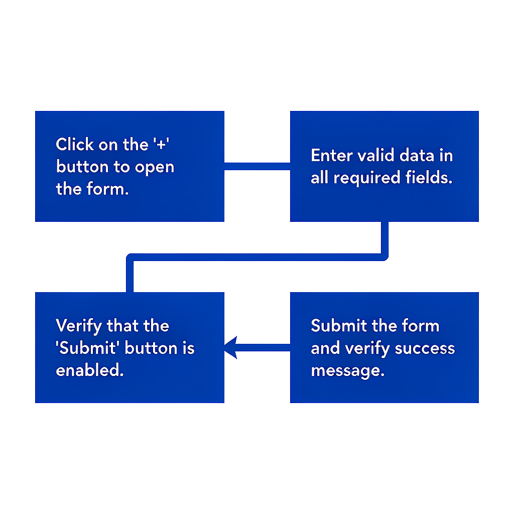
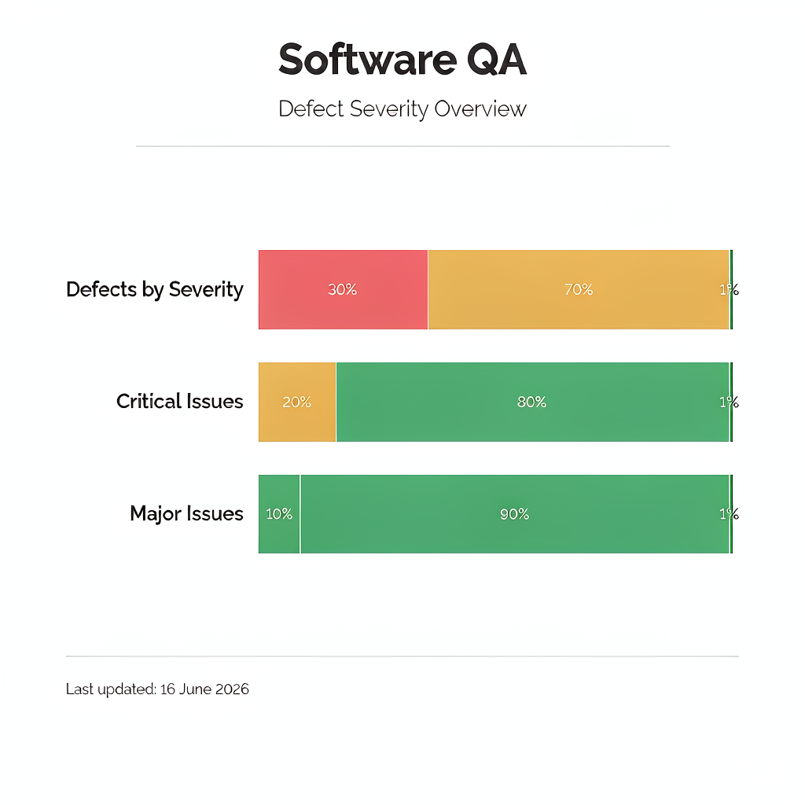
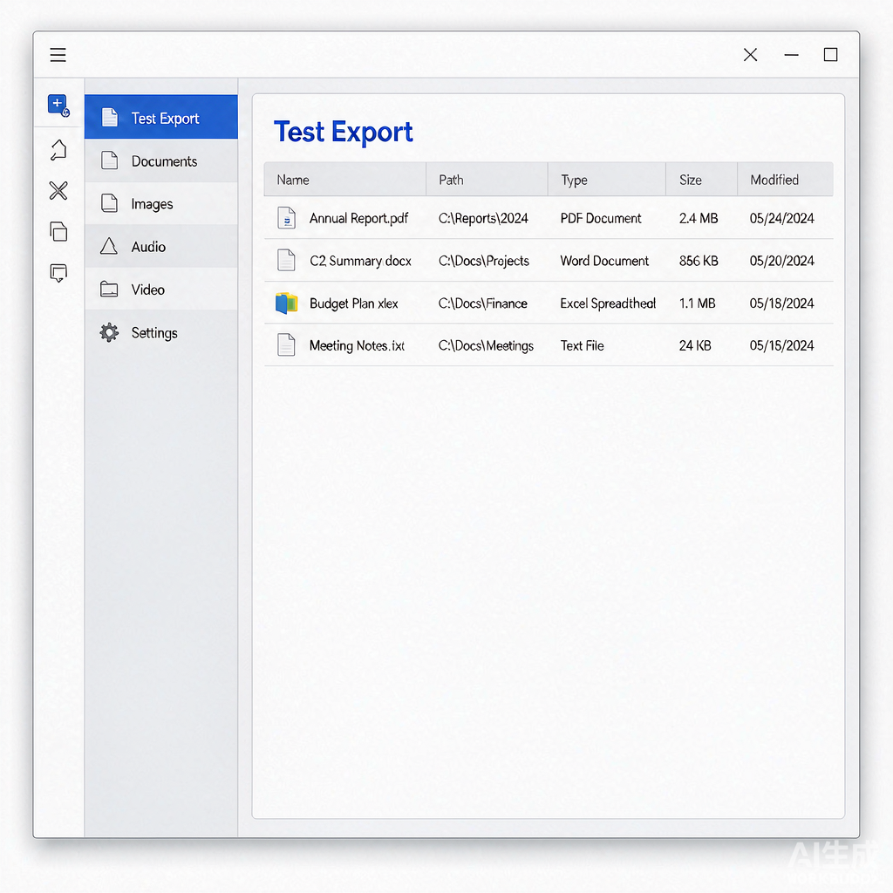

# 图片文档

本文档用于验证 LarkReader 的图片提取与本地化能力。

## 说明

下方会插入多张测试图片，用于验证：

1. 图片能否被 Markdown 解析器识别
2. 图片能否通过 `docs +media-preview` 下载到本地
3. Markdown 中的远程 URL 能否被替换为本地相对路径
4. 图片目录命名是否为 `<文档名>_images/`

## 图片区域

以下内容由 `docs +media-insert` 插入，位于文档末尾。

