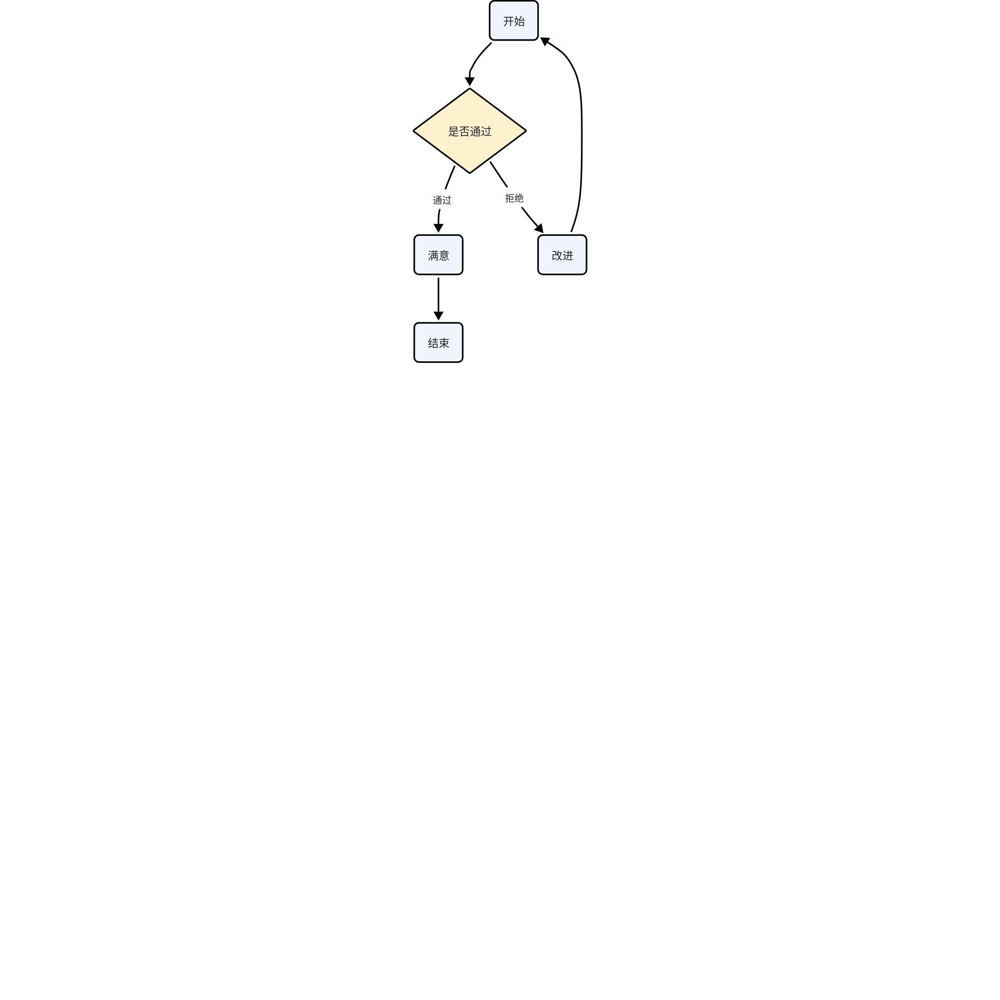
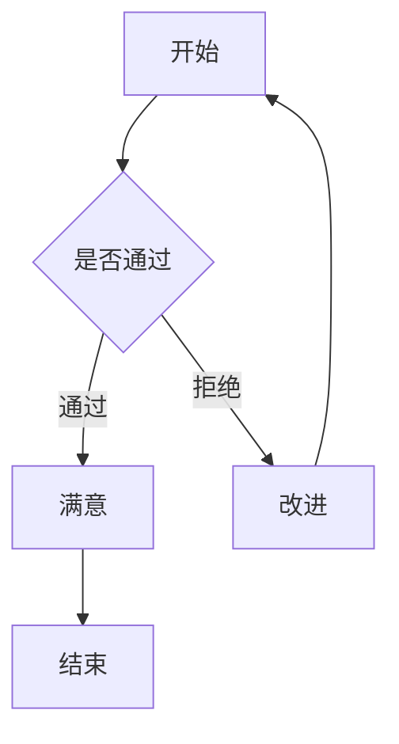
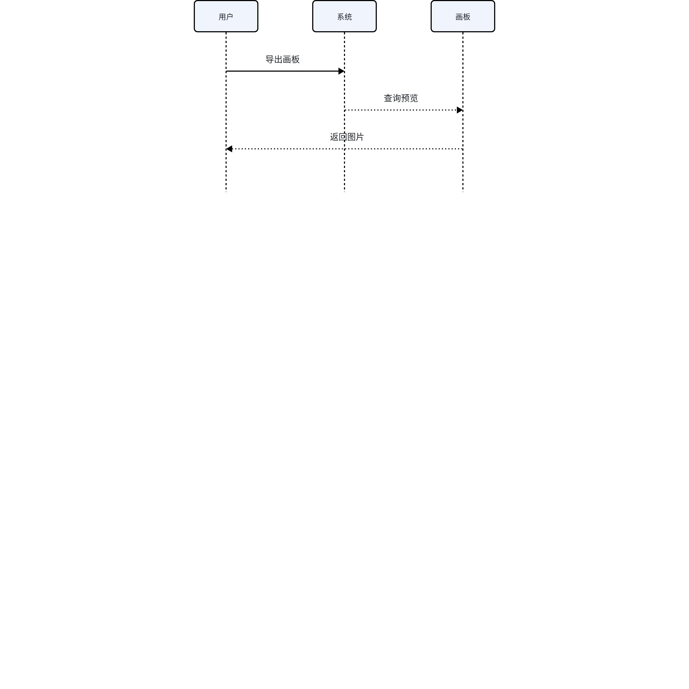
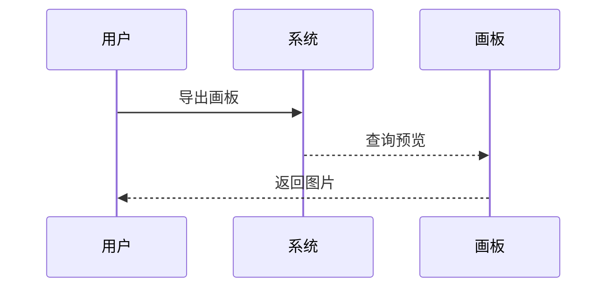

# 画板测试文档-内嵌mermaid-新

```mermaid
flowchart TD
    A[开始] --> B{是否通过}
    B -->|通过| C[满意]
    B -->|拒绝| D[改进]
    C --> E[结束]
    D --> A
```

```mermaid
sequenceDiagram
    用户->>系统: 导出画板
    系统-->>画板: 查询预览
    画板-->>用户: 返回图片
```