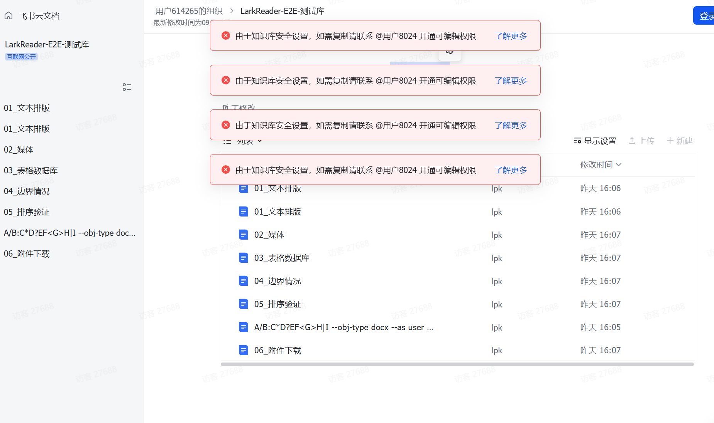

# 使用场景

> 一些文档内部资源比较多，内容比较多；对网络环境要求比较高，对阅读环境要求也比较高。使用 LarkReader，可以方便地预览文档，并使用阅读模式方便地阅读。

## 场景痛点

在日常协作中，飞书知识库经常会遇到这类情况：

- 文档内部资源多、内容体量大，在线查看容易卡顿；
- 网络环境不稳定或访问受限，页面加载慢甚至打不开；
- 阅读环境受限，需要更舒适、更专注的阅读体验。

当知识库开启了“仅允许特定成员复制/导出”的安全设置后，普通成员打开文档时可能会看到大量权限提示，导致关键内容无法复制、无法导出、难以离线使用。

上图是一个典型场景：左侧目录树结构完整，但右侧正文区域被权限提示占据。此时即便你本身拥有阅读权限，也无法把内容保存到本地做进一步处理。

## LarkReader 的解决方式

LarkReader 帮助你在合规、自主的前提下，把知识库内容落到本地：

1. **本地导出**：按飞书目录结构，把允许你访问的文档与资源完整下载到本地；
2. **离线预览**：导出后的 Markdown 与附件可以断网预览，不再依赖实时网络；
3. **阅读模式**：提供适合长时间阅读的排版，减少干扰，提升阅读效率。

## 使用路径

1. 打开 LarkReader，使用你自己的飞书账号完成授权登录；
2. 选择要导出的知识库与节点；
3. 启动导出任务，等待进度完成；
4. 在历史记录中打开导出的本地目录，即可随时阅读。

## 效果

- 无需再逐条申请复制或编辑权限；
- 不再担心网络波动导致页面打不开；
- 在本地获得完整、可搜索、可长期归档的知识库副本。
